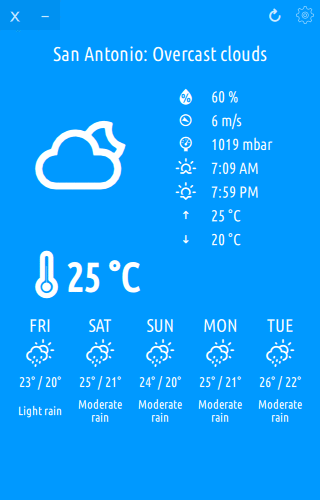
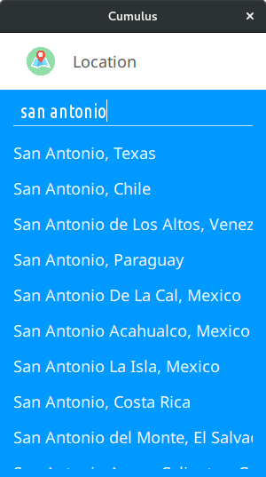
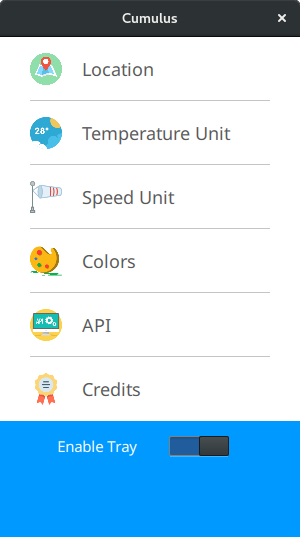

# Cumulus QT
## About
Cumulus is a simple, stylish, weather application, with a back end powered by [Yahoo! Weather](http://weather.yahoo.com) & [Open Weather Map](http://openweathermap.org/)

This is a port to Qt/Qml of the [original cumulus](legacy_cumulus.md)

  

## Features
- Colors selectors for background and text with alpha channel, knock yourselves up out
- Re-sizable window with weather data adjusting accordingly
- Units recalculations on-the-fly without data needed to be re-downloaded
- Tray icon, with additional data to be added on menu :)
- Qt installer, without root installation to allow future updates fast without breaking on upgrade
- Possibility for multiple instances with different settings and locations [Read Here](multiple_inst.md)

## Install/Update
1. Download online installer for x64 bit Linux distributions
 - [Linux amd64](https://github.com/vadrian89/cumulus-qt/releases/)
 - Linux ix86 is to be determined
2. Mark installer executable
`$sudo chmod +x Cumulus-online-installer-x64`
3. Run
`$./Cumulus-online-installer-x64`
4. Enjoy!

To update properly please reinstall, otherwise update application and reinstall libraries only

## Known Issues
- Notice for Xfce users:
You will get an error message, this is due to a script which creates an entry into ".config/autostart/" so it will start on login, simply select ignore and the installer will finish. You will have to manually set to start on login.

## History
Forked from [typhoon](https://github.com/apandada1/typhoon) which was
Based on [Stormcloud](https://github.com/consindo/stormcloud/) by [Jono Cooper](https://twitter.com/consindo)

## Major Thanks
- [Adrian Verban](https://github.com/vadrian89)
- [Daryl Bennett](https://github.com/kd8bny)
- [Archisman Panigrahi](https://github.com/apandada1)
- [Adam Whitcroft](https://twitter.com/AdamWhitcroft)
- [Erik Flowers](https://github.com/erikflowers) for his [weather icons](https://github.com/erikflowers/weather-icons),
which sadly has discontinued support for them

## TODO
- Add another API
